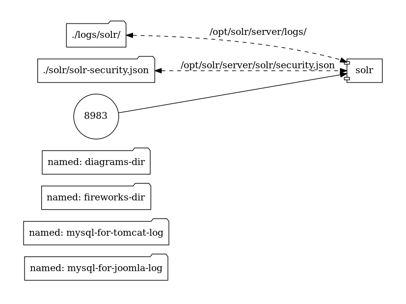
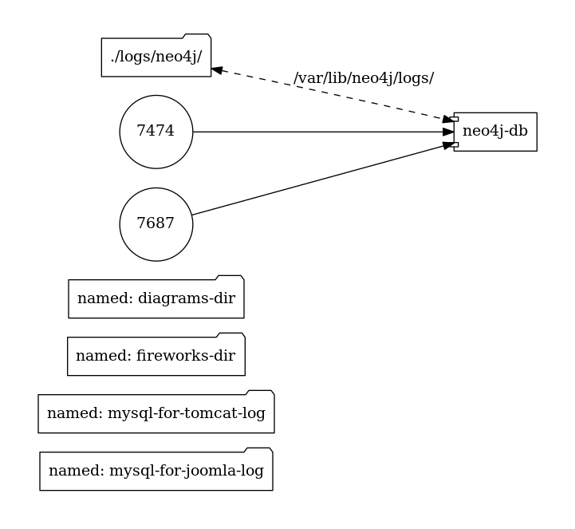

# Reactome Container

## Table of Contents

- [Overview](#overview)
- [Details](#details)
- [Setup](#set-up)
- [Understanding Workflow](#understanding-workflow)
- [How to run](#how-to-run)
- [How to use](#how-to-use)
- [Configuring custom passwords](#configuring-custom-passwords)
- [Troubleshooting](#troubleshooting)

## Overview

[Reactome](http://reactome.org/) is a free, open-source, curated and peer reviewed pathway database. It is an online bioinformatics database of human biology described in molecular terms. It is an on-line encyclopedia of core human pathways. [Reactome Wiki](http://wiki.reactome.org/index.php/Main_Page) provides more details about reactome.

This project enables users to setup a standalone reactome server on their own system. With this server users will be able to run an instance of [Reactome](http://reactome.org/) on their local system. The components of the Reactome server are packaged in  docker containers, so any system capable of running docker can run an instance of this server. The image given below gives a high-level view of the project describing how different components of the project are connected to each other and what endpoints are available to the user for interaction.


The graphs on this page were generated using [docker-compose-viz](https://github.com/pmsipilot/docker-compose-viz). For a better understanding of these graphs, visit [docker-compose-viz/How to read the graph](https://github.com/pmsipilot/docker-compose-viz#how-to-read-the-graph).

### Details

This project builds up a reactome server with all the required java applications inside docker containers and deploys them. A detailed view of structure of the project is shown in the image below. This image describes how files on the host are mapped inside the container.

<div align="center">
  
</div></br>

The graphical representation of each internal service is shown below

<div align="center">
  

  

  

  

  

  


</div>

This project includes the [Reactome/Release](https://github.com/reactome/Release/) repository as a submodule. The website part and perl scripts for the server are derived from there. The Java applications required by Reactome are built from following repositories:

1. [Curator Tool](https://github.com/reactome/CuratorTool)
2. [Pathway Exchange](https://github.com/reactome/Pathway-Exchange)
3. [RESTfulAPI](https://github.com/reactome/RESTfulAPI)
4. [Pathway Browser](https://github.com/reactome-pwp/browser)
5. [Diagram Exporter](https://github.com/reactome-pwp/diagram-exporter)
6. [Content Service](https://github.com/reactome/content-service)
7. [Data Content](https://github.com/reactome/data-content)
8. [Search Core](https://github.com/reactome/search-core)
9. [Analysis Tools](https://github.com/reactome/AnalysisTools)
10. [Interactors Core](https://github.com/reactome-pwp/interactors-core)


## Set Up

Begin with cloning the repository along with its submodule using:

```
git clone --recursive https://github.com/reactome/container.git
```

If above command fails, or if you obtained copy of repository by zipped folder, then you may initialize submodule manually

```
git clone https://github.com/reactome/container.git
cd container
git submodule update --init --recursive
```

Before you can run this project, you need to [install docker](https://docs.docker.com/engine/installation/), [install docker-compose](https://docs.docker.com/compose/install/), and [install git](https://git-scm.com/book/en/v2/Getting-Started-Installing-Git) on your system. To make this easier, an installation script for these tools is provided as [prereqs-ubuntu.sh](https://github.com/reactome/container/blob/master/prereqs-ubuntu.sh). This is a modified version of a script provided by [hyperledger/composer/prereqs-ubuntu.sh](https://hyperledger.github.io/composer/prereqs-ubuntu.sh). It can be run as:

```
cd container
./prereqs-ubuntu.sh
```

## Understanding Workflow

The workflow of project works is described in following steps:

1. Download data and archives: First, we need to get the data files ready. These are downloaded by `deploy.sh -d all` or `deploy.sh -u all`.
2. When database is ready, we need to build Java applications by `deploy.sh -b all`.
3. Now everything is ready, and we can now start the server using `deploy.sh -r`.

These three steps can be combined in one command:

```
./deploy.sh -d all -b all -r
```

## How to run

The first time you run this tool, you will need to download the database files and build all the applications before we run the server. All this is managed by the `deploy.sh` script. You may just execute the given command if you are running this project for the first time:

```
./deploy.sh -d all -b all -r
```

The above command will download all database files and then build all the applications. When using this script for the first time, users are must use `-b all` to build all the applications, since some applications are dependent on others. After that users may select individual applications to build using `select` argument with `-b` flag.

#### Flags used with `deploy.sh`

The `./deploy.sh` script can be run with single or multiple or no flags. The usage of flags is described below:

 - `-d` or `--download` to Download database files. It will remove old database files (if present) and download new files from remote server. This will not include those files which can be built locally (analysis.bin and interactors.db). It will download only these files: database files (neo4j db and tomcat db ), diagrams and fireworks and solr_data.

 - `-d all` or `--download all` to Download all files. It will remove previous files and download new ones. The files that will be affected include: database files, diagrams and fireworks, solr_data. And due to `all` argument, it will also include: analysis.bin, interactors.db.

  -  `-u` or `--update` to Update database files. It will update database files and those files which cannot be built locally. Files which can be built locally will not be affected. This flag plays a two way role. If the files are not present locally, then it downloads the files and if the remote file is newer, then local file is deleted and new one is downloaded. It is like a superset to download flag.

 -  `-u all` or `--update all` to Update all database files. It will include all data archives and also the files which can be built locally, for example, analysis.bin and interactors.db.

 - `-b` or `--build`  is Build flag. Rebuild essential war files.

 - `-b all` or `--build all` is Build all flag. It will build all webapps. Data files like analysis.bin and interactors.db will also be built due to the presence of `all` argument.

 - `-b select` or `--build select` It will allow user to select which webapps to build. By using this flag, the user will be presented with name of the services and from there user will be required to press y/n for yes/no if the service should be built or not.

- `-r` or `--run` is used to run the server. This should be the last flag when you are providing a number of flags. For example, `./deploy.sh --update all --build --run` this command will update all archives, and then build the essential applications, and then start the server, while `./deploy.sh --run --update all --build` this command will just run the reactome server and then exit.

- `-h` or `--help` displays a message with details of all the flags.

## How to use

After the data files have been downloaded and the applications have been built, it will take some time for the docker containers to get ready. When they are ready, the last output in the console will come from the tomcat server. It should look similar to this:

```
tomcat-server       | 26-Aug-2017 02:26:18.986 INFO [main] org.apache.coyote.AbstractProtocol.start Starting ProtocolHandler ["http-nio-8080"]
tomcat-server       | 26-Aug-2017 02:26:19.004 INFO [main] org.apache.coyote.AbstractProtocol.start Starting ProtocolHandler ["ajp-nio-8009"]
tomcat-server       | 26-Aug-2017 02:26:19.013 INFO [main] org.apache.catalina.startup.Catalina.start Server startup in 94422 ms
```

Once you see `Server startup in ...`, the server is ready and you can visit the following endpoints in your browser:

-   `localhost:80` for The Reactome front page.
-   `localhost:8983` for Solr Admin
-   `localhost:7474` for Neo4j Admin
-   `localhost:8082/manager/html` for Tomcat Manager

## Configuring custom passwords

Some services require password for running and they have been provided with the default passwords in their environment file, the files having `.env` extension. The default passwords can be changed by changing the `env` file for corresponding service.

- **Mysql Database:** There are two MySQL databases. One used by `tomcat` and Java applications (this MySQL service will contain the main Reactome MySQL database), whose configurations are stored in `tomcat.env`, and another one used by `wordpress`, whose configurations are stored in `wordpress.env`. In both of them `root` is the default user and if you want to add another user or change the password then you can add following lines to their respective `.env` files:

  ```
  MYSQL_USER=<you_user_name>
  MYSQL_PASSWORD=<you_password>
  ```

  **Mysql for tomcat** If you change configurations for the database used by `tomcat`, modify `tomcat.env`, and make sure that following files are also updated:
  - Update constructor arguments for `bean id="dba"` at  [application-context](https://github.com/reactome/container/blob/master/java-application-builder/mounts/applicationContext.xml#L14)
  - Update values of `-u` and `-p` in AnalysisBin() in [maven_builds.sh](https://github.com/reactome/container/blob/master/java-application-builder/maven_builds.sh#L89)

  **Mysql for wordpress** If you are changing password for wordpress database, you can do it by changing `wordpress.env`
   - Update username and password at [wordpress/secrets.pm#L14](https://github.com/reactome/container/blob/develop/wordpress/Secrets.pm#L14)

- **Tomcat Admin:** Its users and their passwords can be modified in [tomcat-users.xml#L46](https://github.com/reactome/container/blob/master/tomcat/tomcat-users.xml#L46).

- **Neo4j Admin:** Its password can be changed in [neo4j.env](https://github.com/reactome/container/blob/master/neo4j.env#L1) by modifying first line to: `NEO4J_AUTH=<new_user>/<new_password>`
Note: If you modify password of neo4j, then make sure to update changes at
   - [content-service-pom.xml#L26](https://github.com/reactome/container/blob/master/java-application-builder/mounts/content-service-pom.xml#L26)
   - [data-content-pom.xml#L36](https://github.com/reactome/container/blob/master/java-application-builder/mounts/data-content-pom.xml#L36)

- **Solr Admin:**  Its default username and password are "solr"/"solr". This is set in the file [solr/solr-security.json](./solr/solr-security.json). To change this, follow the instructions here:

  https://lucene.apache.org/solr/guide/6_6/basic-authentication-plugin.html#BasicAuthenticationPlugin-AddaUserorEditaPassword

  You will also need to update [content-service-pom.xml](https://github.com/reactome/container/blob/develop/java-application-builder/mounts/content-service-pom.xml#L28) and [data-content-pom](https://github.com/reactome/container/blob/develop/java-application-builder/mounts/data-content-pom.xml#L41)

- **Wordpress:** The username and password for wordpress-admin can be modified by executing following command when the server is running.

  ```
  docker exec -i mysql-database mysql --user=<username_from_wordpress.env> --password=<password_from_wordpress.env> wordpress <<< "UPDATE wp_users SET user_login = 'user_name', user_pass = MD5('password') where id=1;"
  ```

  The changes will be made by service named `mysql-database` and changes will reside in database file internal to `mysql-database` container. If this container is removed, the customized username and password will also get removed.

## Troubleshooting

There are two main applications for use in the repository, one is to build the java applications and other is to run the reactome server. The logs related to build process of java application are stored in `logs/build_webapps.log` and other logs are stored in their specific folder withing `logs` directory. These logs should help you when troubleshooting the components of this applications.

If you are experiencing memory-related issues, you can adjust memory settings (such as `-Xmx` and `-Xms`) by modifying `JAVA_OPTS` in `tomcat.env` file.
