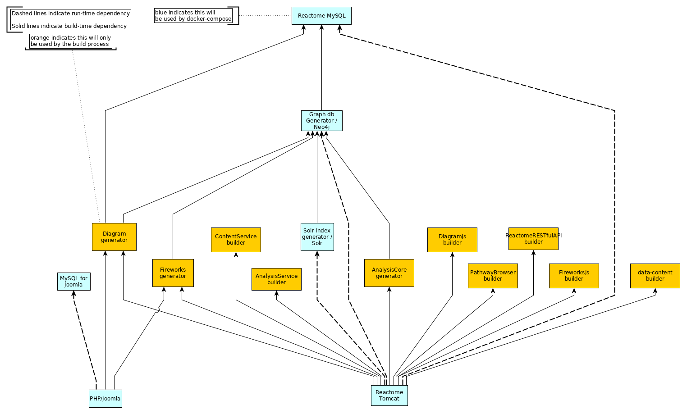

# Reactome Container

## Table of Contents

- [Overview](#overview)
- [Details](#details)
- [Setup](#set-up)
- [Bulding the docker images](#Bulding-the-docker-images)
- [How to use](#how-to-use)
- [Configuration](#configuration)

## Overview

[Reactome](http://reactome.org/) is a free, open-source, curated and peer reviewed pathway database. It is an online bioinformatics database of human biology described in molecular terms. It is an on-line encyclopedia of core human pathways. [Reactome Wiki](http://wiki.reactome.org/index.php/Main_Page) provides more details about reactome.

This project enables users to setup a standalone reactome server on their own system. With this server users will be able to run an instance of [Reactome](http://reactome.org/) on their local system. The components of the Reactome server are packaged in  docker containers, so any system capable of running docker can run an instance of this server. The image given below gives a high-level view of the project describing how different components of the project are connected to each other and what endpoints are available to the user for interaction.


The graphs on this page were generated using [docker-compose-viz](https://github.com/pmsipilot/docker-compose-viz). For a better understanding of these graphs, visit [docker-compose-viz/How to read the graph](https://github.com/pmsipilot/docker-compose-viz#how-to-read-the-graph).

### Details

This project builds up a reactome server with all the required java applications inside docker containers and deploys them. A detailed view of structure of the project is shown in the image below. This image describes how files on the host are mapped inside the container.


The graphical representation of each internal service is shown below

Tomcat


Joomla


MySQL (For Tomcat and Joomla)


Solr


Neo4j


## Set Up

Before you can run this project, you need to [install docker](https://docs.docker.com/install/), then [install docker-compose](https://docs.docker.com/compose/install/), and then [install git](https://git-scm.com/book/en/v2/Getting-Started-Installing-Git) on your system.

Begin with cloning the repository along with its submodule using:

```
git clone --recursive https://github.com/reactome/container.git
```

If above command fails, or if you obtained copy of repository by zipped folder, then you may initialize submodule manually

```
git clone https://github.com/reactome/container.git
cd container
git submodule update --init --recursive
```

## Building the docker images

A number of docker images need to be built in order to run the Reactome services. Many images are used to compile applications or create data. The diagram below illustrates the relationships between these images, and their dependencies.



To build the docker images, use the [`build_all.sh`](./build_all.sh) script>

```bash
bash ./build_all.sh
```

This will build all of the intermediate images which create data or Java applications, as well as the final images which will be run as a part of your Reactome system.

## Log folder permissions

If solr or neo4j log folders have the wrong permissions, the containers will fail to run. To fix this you need to change the following permissions (assuming base directory): 

```bash
chown -R 8983:8983 ./logs/solr
chown -R 100:101 ./logs/neo4j
```

If docker namespacing is set up, just sum uid/gid values with your namespace user's uid/gid.

## How to run

After all images have been built successfully, use docker-compose to create a running Reactome system:

```bash
docker-compose up
```

You will see the output of the various containers on the console. Your Reactome system is ready for use once you see a message from the Tomcat container that says something along the lines of

> org.apache.catalina.startup.Catalina.start Server startup in 53252 ms

You can navigate to [localhost](http://localhost) and you should see the main Reactome web page.

Other local URLs that may be of interest:

- [localhost:8983](http://localhost:8983) - Solr Admin
- [localhost:7474](http://localhost:7474) - Neo4j Admin
- [localhost:8082](http://localhost:8082) - Tomcat Manager

Use <kbd>Ctrl</kbd> - <kbd>C</kbd> to terminate the running system.

You can run docker-compose without `-d` flag once you have confirmed that your setup works correctly. `-d` runs docker-compose as a background process, so you won't see the output on the console.
When you run use `-d`, shutting down the system requires an explicit docker-compose command:

```bash
docker-compose stop
```

It is recommended that you become familiar with other docker & docker-compose commands, in order for you to efficiently work with dockerized tools.

## Configuration

There are some aspects of this system that can be configured.

### Release number

You can configure the release number that will be used when build and running the system. The main place to configure this is in `build_all.sh`. Set the `RELEASE_NUMBER` variable to the Release number that you want to use.

### Passwords

You can configure some passwords for this system.

___
:warning:
_If you plan to run this system on a publicly acccessible system, it is  **STRONGLY** recommended that you change the passwords._
___

#### Neo4j
This password is ininitiall set in the `build_all.sh` script, and propagated to other components that need it. Set the `NEO4J_USER` and `NEO4J_PASSWORD` to your own values.

Also be sure to update [./neo4j.env](./neo4j.env).

#### Solr
The password for the solr user is stored in [./solr/solr-security.json](./solr/solr-security.json). See https://lucene.apache.org/solr/guide/6_6/authentication-and-authorization-plugins.html for more information about how Solr handles security to learn how to modify this file. By default, the password is `solr`, you should change this.

#### Tomcat
The password for the tomcat admin user is found in [./tomcat/tomcast-users.xml](./tomcat/tomcast-users.xml). By default, the admin user is configured as

```xml
<user username="tomcat" password="tomcat-admin" roles="manager-gui"/>
```

You should change the username and the password.

#### MySQL
The MySQL containers should not have any publicly exposed ports when running. However, if you want to change the password for the database used by Tomcat, that can be set in [./mysql/mysql.dockerfile](./mysql/mysql.dockerfile); set the `MYSQL_ROOT_PASSWORD` variable. It will also need to be set in [./neo4j/neo4j_generated_from_mysql.dockerfile](./neo4j/neo4j_generated_from_mysql.dockerfile). Also be sure to update [./tomcat.env](./tomcat.env).

For Joomla, you will need to set the passwords in [./joomla.env](./joomla.env).
